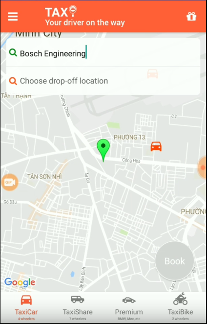

# Carsharing application using react-native and redux.
## About Taxi App
Latest work as of now (Part 10), video is available at: [Youtube](https://youtu.be/8lS8dUDIQCc)

Test binary can be downloaded from [TaxiApp android](releases/taxi-app.apk)





## Libraries Stack
### Production
Beside  ```react``` and ```react-native``` libraries as default, below are additional ones & their purposes
+ [Redux](https://redux.js.org/): Typical state container (storages) for your react application.
  + [Redux Thunk](https://github.com/gaearon/redux-thunk) Async execution for redux (as middleware). 
    + [Redux Saga](https://github.com/redux-saga/redux-saga) maybe the better alternatives to avoid callback chains.
  + [Redux Binding](https://github.com/reactjs/react-redux) to provide global states, actions (dispatch) to react component state. 
+ [Native Base Component](https://nativebase.io/) Provide cross platform UI components.
+ [react-native-router-flux](https://github.com/aksonov/react-native-router-flux) Provide the navigation platform between screen & history.
  + [reactnavigation](https://reactnavigation.org/) Maybe the other alternative good candidates from react native community.
+ [SVG Icons](https://github.com/oblador/react-native-vector-icons) Beside icons from ```native-base```, ```react-native-vector-icons``` provide much more options.
+ [Map](https://github.com/airbnb/react-native-maps) Provide map component for react native, both Android + iOS platform.
+ [Google Places API](https://github.com/tolu360/react-native-google-places) library to use google place API in react-native.
+ [Spinkit](https://github.com/maxs15/react-native-spinkit) For the cool spin components.
+ [Redux state update](https://github.com/kolodny/immutability-helper) Helper to provide mutability of states (predictable)

### Development
+ [redux-logger](https://github.com/evgenyrodionov/redux-logger) Redux middleware to log all state changes.
+ [flow-bin](https://github.com/facebook/flow) Static typechecker for JavaScript
+ [Story Book](https://storybook.js.org/) Component style preview.

## References
Steps guideline from [eman1000/TaxiApp](https://github.com/eman1000/TaxiApp)

## What's differences from original guideline?
### General
+ [Prettier](https://prettier.io/) integrated for code formatter.
+ [Flow](https://flow.org/) integrated for static type checker.
+ Android implementation instead of iOS, so I could use ```react-native link``` without any problems which have been highlighted in original guideline.
+ Upgrade all libraries to latest version, including the drop of deprecated library e.g. ```react-addons-update``` and replace by ```immutability-helper```
+ Apply props type validation from reactjs best practices.

### Structure
+ No AppContainer: App container are merged together with [AppRoot](src/index.js) component
+ Modules folder: It will contain 3 files: module file, **actions file**, **handlers file**, there is no **constants files**. Refer [Home](src/routes/Home/modules/) module.
+ App Bar: Instead of hide the navigation bar (using ```hiddenNavBar```) and create new custom Header component in Home, ```react-native-router-flux``` navigation bar itself is customized by using ```navBar```. Refer [Scenes](src/routes/scenes.js)
+ Header: Use of ```Subtitle``` in Header along with ```Title``` 
+ I got problems when using redux store with hot reload feature because store will be created everytimes application is hot-reloaded. Store is now created in constructor instead of ```render```, refer [AppRoot](src/index.js)
+ Fares are calculated and displayed at Footer.
+ Welcome screen and display loading indicator when load user current information.

### Logic
+ Place picker: ```openPlacePickerModal``` is being used as built-in picker instead of our own UI + ```getAutocompletePredictions```. This lead to huge differences in actions & handlers of home component, refer [HomeActions.js](src/routes/Home/modules/HomeActions.js)
  + ```RNGooglePlaces``` API is called from react native component instead of module layer,  refer [SearchBox](src/routes/Home/components/SearchBox/index.js)
+ Taxi types e.g. Premium, Share, Car, Bike can be selectable, refer [Footer](src/global/Template/components/AppFooter.js)
+ Use ```native-base``` layout e.g. Header, Content, Footer combination.
+ Initial, current location will be used as pickup location.
+ Fare calculation formula & display for all Taxi.
+ No server or socket.io implementation.

## TODO list
+ Place picker will be shown when When pickup (or dropoff) text box are firing focus event. Hence, dropoff picker will not display again when text box is in focus state and you want to change the place. Workaround is un-focus the text box first.
+ Customize the place picker of ```react-native-google-places``` to align with themes.
+ Server implementation for booking request & drivers tracking.
+ Driver application.
+ iOS test.

## Known issues
+ Book button have to touch twice to trigger ```onPress```, why?

## Common problems
```
Element type is invalid. Expected a string (For a built-in component) or a class/function
```
I got it resolved by change the import statement.
```import { Name } from "module"``` to ```import Name from "module"```
***
```
Command `run-android` unrecognized. Make sure that you have run `npm install` and that you are inside a react-native project.
```
When execute ```react-native run-android```, you got above error. I got it resolved by execute ```yarn``` on root project folder.
***
After add spinkit dependencies and ```react-native link```, Still compilation error related to ```react-native-spinkit``` class not found. Resolve it by adding into ```app/build.gradle```
```
dependencies {
  compile project(':react-native-spinkit')
  ...
}
``` 
***
Problem related to redux stores when using hot reload, refer to [Structure difference](#structure)
***
```
Unable to resolve module <module name> from <path>...
```
If module is from our application then check your import statement if the path to module is correct.
But if module is from library then ```npm install``` will resolve problem.
***
Close your package bundler server when got following message, if it does not work then manual delete ```build``` folder.
```
* What went wrong:
Execution failed for task ':app:processDebugResources'.
> java.io.IOException: Could not delete path 
```
***
Because we added debug, release buildTypes which are differenciate by ```applicationIdSuffix``` so application will not be launched automatically when running ```react-native run-android```.
Following error will occured at the end of build.
```
BUILD SUCCESSFUL
...
Error type 3
Error: Activity class {com.fireevacuation/com.fireevacuation.MainActivity} does not exist.
```
Run with ```--appIdSuffix``` parameter will fix the issue.
```
react-native run-android --appIdSuffix debug
```